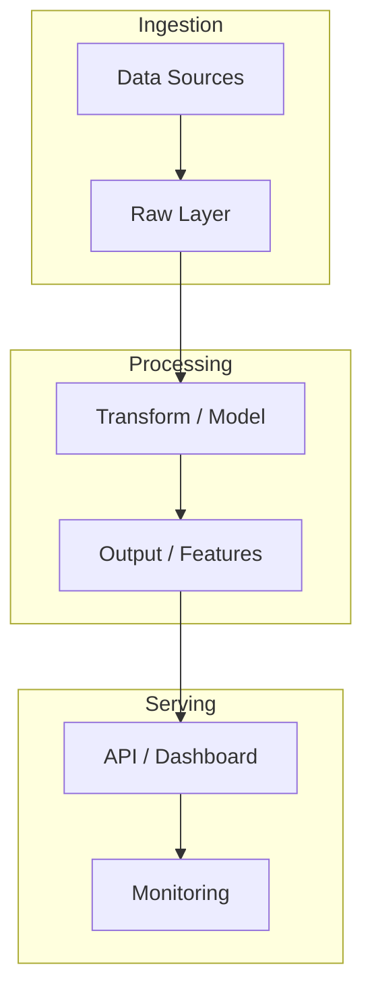

# inventory-optimization-system

> MILP inventory optimization with Gurobi: minimize total cost (holding+stockout+ordering). Benchmarked vs OR-Tools. Streamlit dashboard with OTIF, fill rate, service level KPIs.

**Stack:** Azure Databricks · PySpark · Snowflake · Gurobi MILP · OR-Tools · Streamlit

**KPIs:** Fill rate +12% · OTIF reportado · Gurobi MILP

---

## Problem Statement

<!-- Describe the business problem this project solves -->

## Architecture



## Tech Decisions & Trade-offs

| Decision | Choice | Reason |
|----------|--------|--------|
|          |        |        |

## Results

| Metric | Value |
|--------|-------|
| KPI 1  | —     |
| KPI 2  | —     |

## How to Run

```bash
git clone https://github.com/lcarrenoy/inventory-optimization-system.git
cd inventory-optimization-system
uv sync
cp .env.example .env
uv run python src/main.py
```

---

*Part of [Luis Carreño's Portfolio](https://github.com/lcarrenoy) · AI Engineer · Financial Engineering · Score 9.8/10*
